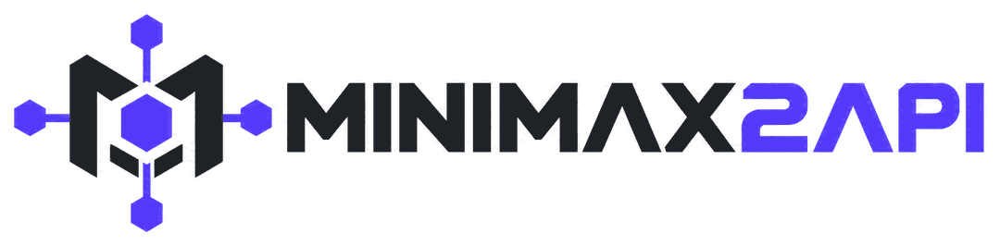

<p align="center">
  <picture>
    <source media="(prefers-color-scheme: dark)" srcset="assets/logo-dark.png">
    <source media="(prefers-color-scheme: light)" srcset="assets/logo-light.png">
    
  </picture>
</p>

<h1 align="center">MiniMax2API</h1>

<p align="center">
  把 <a href="https://agent.minimax.io/">MiniMax Agent</a> 的 Web 端能力封装成 <b>OpenAI 兼容 API</b>，<br>
  同时提供 <b>Anthropic Messages 兼容端点</b>，并配一套管理台 + 号池调度。
</p>

后端是纯 Go 标准库，**无第三方依赖**，单二进制 + 单 JSON 文件即可运行。前端 React 19 + Vite + Tailwind 4，组件自建、零依赖。

---

## 免责声明

本项目仅供**学习与技术研究**。它对接的是第三方服务的 Web 端接口，而该服务并未提供公开 API。

- **签名算法是从前端 bundle 逆向出来的**，静态盐值硬编码。上游随时可能更换算法，届时本项目会失效——这是这类项目的固有属性，不是 bug。
- **批量使用账号可能触发上游风控**，导致账号被限制或封禁。请只使用你自己的账号。
- **自动签到**本质上是自动化操作多账号，请自行判断是否适合你的场景。
- 请勿用于商业转售、二次分发额度或任何绕过付费的用途。
- 本项目与 MiniMax 官方无任何关联。

---

## 特性

**API**

| 端点 | 说明 |
| --- | --- |
| `POST /v1/chat/completions` | 流式 / 非流式，OpenAI 格式。**所有模型类型都从这个口进** |
| `POST /v1/messages` | Anthropic Messages 兼容，Claude Code / Kiro 等客户端可直接接入 |
| `POST /v1/images/generations` | 图像生成 |
| `POST /v1/videos/generations` | 视频生成 |
| `POST /v1/files` | 文件上传（OpenAI Files 兼容），列表 / 详情 / 下载 / 删除同套 |
| `GET /v1/models` | 模型列表 |
| `GET /health` | 健康检查 + 号池概览 |

**号池**

- 多账号令牌池，「国内站 + 国际站」双区域混放，调度时各走上游域名
- 四种调度策略：`least_inflight`（默认）/ `round_robin` / `priority` / `random`
- 粘性会话、指数退避冷却、凭证失效标记、请求级故障转移
- 批量导入 / 导出 / 启停 / 改并发 / 清冷却
- 加号只需粘 JWT，账号标识、区域、指纹、`realUserID` 由服务端自动补齐

**签到与积分**

- 后台按天自动给国际站账号签到，结果直接落在号池列表的「签到」「积分」两列
- 零积分账号在请求中自动跳过（带新鲜期，过期后重新参与调度）
- 支持单账号「立即签到」/「刷新积分」与一键全部签到

**管理台**

- 仪表盘、号池管理、客户端密钥、模型目录、生成画廊、请求审计、系统设置
- 中英双语，明暗双主题
- 会话基于 Bearer Token，密码用 HMAC-SHA256 迭代 12 万次加盐存储

**其他**

- 函数调用（**模拟实现**，靠提示词约定，非上游原生能力）
- 请求审计，保留天数与条数可配，后台定时清理
- 图片 / 文件上传，附件与多模态参考

---

## 快速开始

### 环境要求

- Go 1.24+
- Node.js 20+（仅在需要重新构建前端时用到）
- **一个境外出站代理**（部署在境外机器上则不需要）

> 国际站的业务请求有地域围栏，直连会返回**空 body 的 `401`**，看起来极像令牌失效。见下方「出口 IP」。

### 构建

```bash
# 1. 前端（产物输出到 frontend/dist）
cd frontend
npm install
npm run build

# 2. 后端（产物是仓库根目录的 minimax2api）
cd ../backend
go build -o ../minimax2api ./cmd/minimax2api
```

### 运行

```bash
MINIMAX2API_ADMIN_PASSWORD=你的密码 ./minimax2api -addr 127.0.0.1:8080
```

打开 `http://127.0.0.1:8080`，用 `admin` / 你设置的密码登录。

> 不传 `MINIMAX2API_ADMIN_PASSWORD` 时，首次启动会随机生成密码并打印在控制台。

### 加号

**取令牌**：登录 MiniMax Agent，随便发一条消息，F12 → `Application → Local Storage`，找到 **`_token`** 的值（一个 JWT）。

**录入**：管理台 → **号池管理** → 添加账号，把 JWT 整段粘进「登录令牌」即可。区域自动判断，指纹自动生成，`realUserID` 由服务端自己去上游问回来。

> 想手工指定身份也可以，格式是 `realUserID+JWT`（形如 `9007199254740993+eyJhbGciOi...`）。

批量导入每行一个，支持以下写法：

```
eyJhbGciOiJIUzI1NiIs...
主号----eyJhbGciOiJIUzI1NiIs...
cn:eyJhbGciOiJIUzI1NiIs...
备用号----eyJhbGciOiJIUzI1NiIs...----global
```

导入框的**区域**默认「自动识别」，逐行读令牌里的手机号区号，国内号和国际号可以混在一份列表里一次导完。整批都是同一站点（或令牌里没有手机号推断不出来）时，选定 `国内` / `国际` 强制覆盖。

> 已存在的账号会被**更新**而不是报错——令牌过期后重新导入同一行即可刷新。

### 调用

```bash
# 先在管理台「客户端密钥」建一个 key
curl http://127.0.0.1:8080/v1/chat/completions \
  -H "Authorization: Bearer sk-mm-xxxxxxxx" \
  -H "Content-Type: application/json" \
  -d '{"model":"minimax-agent","messages":[{"role":"user","content":"你好"}],"stream":true}'
```

讲 Anthropic 协议的客户端走 `/v1/messages`，用同一个 key：

```bash
curl http://127.0.0.1:8080/v1/messages \
  -H "Authorization: Bearer sk-mm-xxxxxxxx" \
  -H "Content-Type: application/json" \
  -d '{"model":"claude-sonnet-4-20250514","max_tokens":1024,
       "system":"你是一个简洁的助手","messages":[{"role":"user","content":"你好"}]}'
```

`model` 填不认得的值不会报错——会**回落到默认对话模型**，这样 Claude 客户端才接得上。

---

## 模型

| 模型 ID | 类型 | 说明 |
| --- | --- | --- |
| `minimax-agent` | chat | 通用 Agent，自动规划并调用工具（默认） |
| `minimax-m3.1-flash-preview` | chat | 预览版，支持 `reasoning_effort` 档位 |
| `minimax-m3` | chat | 对话模式，响应更快 |
| `minimax-m3-thinking` | chat | 深度思考，推理内容走 `reasoning_content` |
| `minimax-m2.7` / `minimax-m2.7-highspeed` | chat | 上一代对话模型及其高速版 |
| `minimax-image` | image | 图像生成 |
| `minimax-h3` | video | H3.0，质量优先，消耗账号积分 |
| `minimax-h3-max` | video | H3 Max，约 20 秒完成（唯一能同步返回的） |
| `minimax-hailuo-2-3` | video | Hailuo 2.3，成本更低，输出无声视频 |

**每个模型 ID 都能在 `/v1/chat/completions` 上用**，因为 OpenAI 的 `/v1/models` schema 里没有任何字段能表达「这是图像模型」——客户端会把列表里的每个 id 都当成对话模型填进下拉框。所以本网关的原则是：**列出来的就能用**。

| 类型 | `/v1/chat/completions` | `/v1/images/generations` | `/v1/videos/generations` | `/v1/messages` |
| --- | --- | --- | --- | --- |
| `chat` | ✅ | — | — | ✅ |
| `image` | ✅ 图片以 Markdown 回在正文里 | ✅ | — | — |
| `video` | ✅ 整轮被改写成插件引用 | — | ✅ | — |

> chat 类模型的 ID **最终打的都是同一个上游 Agent**，上游按账号默认模型回答——这些条目只是标签。上游模型选择器走在消息请求体里，可在「系统设置 → 上游 → `model` 字段模板」配置。

---

## 配置

### 启动参数 / 环境变量

| 参数 | 环境变量 | 默认值 | 说明 |
| --- | --- | --- | --- |
| `-addr` | `MINIMAX2API_ADDR` | `127.0.0.1:8080` | 监听地址 |
| `-data` | `MINIMAX2API_DATA` | `data` | 数据目录 |
| `-static` | `MINIMAX2API_STATIC` | `frontend/dist` | 前端产物目录 |
| `-admin-user` | `MINIMAX2API_ADMIN_USER` | `admin` | 初始管理员用户名 |
| `-admin-password` | `MINIMAX2API_ADMIN_PASSWORD` | 随机 | 初始管理员密码 |

### 运行时设置

配置存在 `data/app.json`，可在管理台「系统设置」直接改，改完即时生效：

- **服务**：最大并发请求数、管理员用户名
- **上游**：站点地址、Agent ID、会话 / 消息路径、`model` 字段模板、请求超时、**代理（国际站必填）**、User-Agent
- **路由**：调度策略、冷却基数与上限、最大重试次数、粘性会话 TTL
- **审计**：保留天数、最大记录数、是否记录请求体
- **媒体**：生成文件目录、公开访问前缀、容量上限、是否自动转存
- **签到**：开关、每日时刻、账号间隔、积分新鲜期、时区偏移
- **视频生成**：插件名、参数标签名、默认画幅 / 分辨率 / 时长、单轮超时

> ⚠️ **默认值是「安装时冻结」的**：全新安装会把整套默认值写进 `app.json`，之后 `Normalize` 只补缺失的键、不动已存在的键。所以**改一个默认值只影响新安装**——存量实例会带着旧值静默运行。
>
> 修法是**迁移**：`Normalize` 里维护一张已知坏值清单，命中就改回默认并写回磁盘。以后加默认值修复，记得同时加进那张清单。

---

## 上游协议要点

MiniMax Agent 没有公开 API，这里是把它 Web 端的调用方式复刻出来。端点与请求体结构做成了运行时可配置，上游改版时不用重新编译。

### 请求签名

每个请求带四个头：

| 请求头 | 计算方式 |
| --- | --- |
| `token` | 账号的 JWT |
| `x-timestamp` | 当前 Unix 秒 |
| `x-signature` | `MD5(秒级时间戳 + 静态盐 + 请求体)` |
| `yy` | `MD5(encodeURIComponent(完整URL) + "_" + 请求体 + MD5(毫秒级时间戳) + "ooui")` |

`x-signature` 与 URL 无关；**`yy` 绑定了完整 URL**，而 URL 的 query 里装着指纹字段。所以 **query 的参数顺序也是协议的一部分**——实现里没用 `net/url` 的 `Values.Encode()`（会按键排序），而是按固定顺序手工拼接。

> Go 的 `url.QueryEscape` 不能替代 JS 的 `encodeURIComponent`（空格、`~`、`!*'()` 的处理正好相反），所以后者是照着 JS 语义自己实现的，并有逐字符单元测试钉住。

### 账号身份与出口 IP

签名之后还有**两个各自独立、缺一不可**的条件，缺任何一个都只给你一个空 body 的 `401`：

1. **query 里必须带 `?user_id=<realUserID>`**，且值必须正确
2. **出口 IP 必须在境外**

- **`realUserID` 不等于 JWT 里的 `user.id`**，两者是同一账号里两个不同的 18 位数字。填错等于没填，且**无法从令牌推导**。加号时后台会调 `GET {base}/v1/api/user/info`（唯一不需要 `user_id` 的端点）把它问回来。
- **它超过了 2^53**，必须以**字符串**读入，走 float64 会被静默舍入成另一个数。
- **出口 IP 是硬门槛**：同一请求、同一令牌，走代理 200，直连 401。所以 `upstream.proxy` 在国际站上基本必填。

> 排查分诊：签名错会明说 `400 invalid signature`；**空 body 的 `401` 就是身份或出口问题**，别再怀疑盐值。

网关自己发往回环地址的请求**一律绕过代理**（`127.0.0.0/8`、`::1`、`localhost`），私有网段不绕过。

### 调用流程

```
POST {base}/minimax-cloud/api/v1/agent/{agent_id}/session        → 建会话，拿 session_id
POST {stream}/minimax-cloud/api/v1/session/{session_id}/message  → SSE 流，取 msg_content
```

两条路径**不在同一个域名上**：发消息走 `agent-stream.<domain>`，其余接口走 `agent.<domain>`。同一条路径放在 API 域名上会进到另一个入口，那一侧能收到消息、能回复，但**没有渲染工具**——视频请求会变成一段「描述了这个视频」的文字。

### 上游初始化

**发消息和签到之前都必须先跑一遍初始化序列**，顺序不能反：

```
GET /minimax-cloud/api/v1/config              ← 创建/激活 agent 侧用户记录
GET /minimax-cloud/api/v1/agent               ← agent 列表（顺带拿到数字 id）
GET /minimax-cloud/api/v1/channel/connections
```

不调它，新号发消息会 500 并报 `Environment Variables not configured`（文案完全误导）；而**顺序反了积分会静默丢失，且事后补调救不回来**——领取接口照样回 `claim_result=1`。

> **`{agent_id}` 是一个数字，不是角色名。** 传 `general` 上去，上游会回 **200 但不给你 `session_id`**——看起来完全成功，实际什么都没开。加号时后台会从 agent 列表里问回真实编号。

### 流式解析

适配器**按 payload 字段分流，不依赖上游的事件类型编号**：判断依据是 payload 里出现了 `msg_content` 还是 `reasoning_content`，未知帧安全跳过。上游重新编号不会让解析器静默失效。

一个容易踩的坑：上游为**每条**消息发两帧——`agent_message_chunk` 是增量流（正文的唯一来源），`agent_message` 是整条重述（含 `role: "user"` 的请求回显）。只认 `msg_content` 键名而不看容器和角色，就会把**人设和全部历史跟着答案一起返回**，并把答案说两遍。适配器按容器分流，回显帧直接丢弃。

---

## 函数调用（模拟）

**先说结论：上游没有这条通道，这里是模拟的。** 发消息的请求体是一张固定字段表（`content` / `attachments` / `model` / `turn_id` / `enable_team` / `client_intent` / `worktreeMode` / `workspace_dir`），**没有任何一项装得下工具定义**。

实现方式：请求带 `tools` 时，声明会被拼进提示词，并要求模型在回复末尾用一个标记块作答：

```
<tool_calls>
{"name": "get_weather", "arguments": {"city": "北京"}}
</tool_calls>
```

解析成功就摘出来变成标准的 `tool_calls` / `tool_use`，`finish_reason` 变成 `tool_calls`。三条刻意的取舍：

1. **绝不悄悄换模型**——带工具的请求跑在调用方指定的模型上。
2. **解析不了就原样保留**——只有解析成功的块才从正文里摘掉。
3. **只在声明了工具时才解析**——没带 `tools` 时，`<tool_calls>` 就是普通文本。

**该不该用**：客户端自己会跑循环、工具定义简单时可以。**别把工具调用当可靠的控制流**——它终究是一个格式约定，解析失败时你拿到的是正文而不是调用。

---

## 部署

1. `go build -ldflags "-s -w"` 出精简二进制，配合 `frontend/dist` 一起丢到服务器
2. 用 systemd / supervisor 常驻，监听 `127.0.0.1:8080`
3. 前置 Nginx 反代，**必须关闭响应缓冲**，否则 SSE 流式会被攒批：

```nginx
location / {
    proxy_pass http://127.0.0.1:8080;
    proxy_http_version 1.1;
    proxy_set_header Host $host;
    proxy_set_header X-Real-IP $remote_addr;
    proxy_buffering off;
    proxy_cache off;
    proxy_read_timeout 600s;
    chunked_transfer_encoding on;
}
```

4. 管理台只对内网开放，或加一层访问控制
5. `data/` 目录做好备份——账号令牌都在里面

> 静态资源缓存后端已分好两档，不需要在 Nginx 里额外配：入口 HTML `no-cache`，`/assets/*` 长缓存（产物名带内容 hash）。

---

## 项目结构

```
backend/
  cmd/minimax2api/      入口：路由装配、静态托管、优雅关闭
  internal/config/      启动参数 + 运行时设置模型
  internal/store/       状态与持久化（内存态 + 单文件）
  internal/pool/        号池调度
  internal/minimax/     上游协议客户端（签名、会话、SSE、令牌解析、签到/积分）
  internal/signin/      每日签到调度 + 积分轮询
  internal/gateway/     OpenAI / Anthropic 兼容层、函数调用模拟、限流
  internal/admin/       管理台 API
frontend/
  src/app/              壳层与路由
  src/components/ui/    自建 UI 组件（零依赖）
  src/features/         各功能页
  src/shared/           API 客户端、鉴权、i18n、工具
tools/                  自检脚本（冒烟 / 契约 / 字段 / 签到 / 渲染 / 密钥扫描）
assets/                 logo
```

**持久化**：`data/app.json` 是唯一状态文件。变更先改内存，再由单个后台协程防抖（40ms）后原子落盘。请求处理路径**不会**在持锁期间做磁盘 I/O。

---

## 自检

```bash
cd backend
go test ./...    # 单元测试（含并发 / 重入锁回归）
go vet ./...
```

端到端（需先启动服务）：

```bash
python tools/smoke.py    --base http://127.0.0.1:8080 --password 你的密码 --skip-upstream
python tools/contract.py --base http://127.0.0.1:8080 --password 你的密码   # 接口契约
python tools/fields.py   --base http://127.0.0.1:8080 --password 你的密码   # DTO 字段契约
python tools/signin_e2e.py --base http://127.0.0.1:8080 --password 你的密码 # 签到链路（自建假上游）
node tools/render.mjs http://127.0.0.1:8080 http://127.0.0.1:9222 你的密码  # 真实渲染（需本机 Chrome）
```

推送前扫密钥（工作树 + 全部历史）：

```bash
python tools/secret_scan.py
git config core.hooksPath tools/hooks    # 装成 pre-commit 钩子
```

---

## 常见问题

**Q：所有请求都返回空 body 的 `401`？**
不是令牌坏了，是**出口 IP 在国内**（国际站有地域围栏）或账号缺 `user_id`。配上 `upstream.proxy` 立刻 200。注意分诊：签名错会明说 `400 invalid signature`。

**Q：签到一直正常，一发消息就 400 `internal error`？**
查 `device_id` 是不是**纯数字**。上游对 `uuid` 宽容、对 `device_id` 不宽容，而非数字的 `device_id` 只让 `/minimax-cloud/…` 挂掉，签到端点照常 200——所以表现就是「签到没事、聊天全废」。在号池管理里编辑账号、清空 `device_id` 让系统重新生成即可。

**Q：国内站账号加进去一直失败？**
区域没选对。国内站令牌拿到国际站域名上必然被拒——把区域改成 `国内`，或选「自动识别」让系统读令牌里的 `+86`。令牌里没有手机号时按国际站处理。

**Q：`agentID` 填 `general` 行不行？**
不行。`general` 是角色名不是编号，传上去上游会回 **200 但不返回 `session_id`**。正常流程下加号时后台会自己问回数字编号。老版本默认值正是 `general`，升级时自动迁移。

**Q：视频请求返回了一段「描述这个视频」的文字，没有视频也没有报错？**
**进错门**了。发消息必须走 `agent-stream.<domain>`。老版本默认值是 API 域名 + `/archon/…` 路径，升级时自动迁移。想手动核对，看「系统设置 → 上游」的**对话流地址**与**消息路径**。

**Q：视频接口返回 `status: "pending"` 且 `data` 为空，是失败了吗？**
**不能只看 `status`。** 它把两种完全不同的情况合在了一起：慢模型（`h3` / `hailuo-2-3`）官方标注 15–30 分钟，任何同步 HTTP 都等不到；以及上游根本没执行。区别只写在 `detail` 里（Agent 的原话），**请读它**。想要同步拿到 mp4 用 `minimax-h3-max`。

**Q：视频生成把余额扣了却没产出？**
**扣费与产出是解耦的**——不要把「余额下降」当成「生成成功」的证据。排查时先用不花钱的 `GET`（`/config`、`/skill`、`/plugins/enabled`）确认账号能力，再决定要不要花钱发消息。

**Q：视频请求发出去后 Agent 反过来问我时长 / 分辨率？**
参数没填满。插件会**先问清楚未指定的项再开始生成**，而接口调用没人可答——少一个参数就是这一轮什么都不产出。把 `duration` / `ratio` / `resolution` 都传上，或确认系统设置里的默认值非空。

**Q：接到角色扮演前端上，回复里把人设和历史对话一起吐出来了？**
适配器把上游的**回显帧**当成了回答，不是模型在复述。详见「上游协议要点 → 流式解析」。

**Q：流式响应是一坨出来的，不是逐字？**
反代开了响应缓冲，关掉 `proxy_buffering`。

**Q：生成的文件下载不下来？**
转存走的是和 API 同一个代理。生成物在 MiniMax 的 CDN 上，出口围栏同样适用——本地直连会失败，表现为超时或连接重置。生成物默认转存到 `data/generated/`，通过 `/media/` 对外提供。

**Q：签到显示「已跳过」，是坏了吗？**
不是。跳过有明确原因，账号记录里会写明：国内站账号走的是另一套签到参数（`timezone_id` 而不是 `timezone_offset`）；或账号缺 `realUserID`（这时发请求必定 401，而 401 会让账号被当成坏号退役）。跳过是**成功语义**，不影响账号健康。

**Q：上游改版后全部 404 / 400？**
路径变了。重新抓一次包，在「系统设置 → 上游」里更新，不用重新编译。

---

## 许可证

本项目以 **GNU Affero General Public License v3.0（AGPL-3.0）** 发布，协议全文见 [LICENSE](LICENSE)。

```
Copyright (C) 2026 juangchuank-ops
```

- **改了要公开**：若把修改后的版本通过网络对外提供服务，必须把完整源码同样以 AGPL-3.0 提供给使用者。
- **保留声明**：分发时保留版权声明与许可证文本。

> 免责声明里的「请勿用于商业转售」是**作者意图的请求**，不是许可证的附加限制。AGPL-3.0 本身允许商业使用——它约束的是**闭源**，而不是**收费**。
